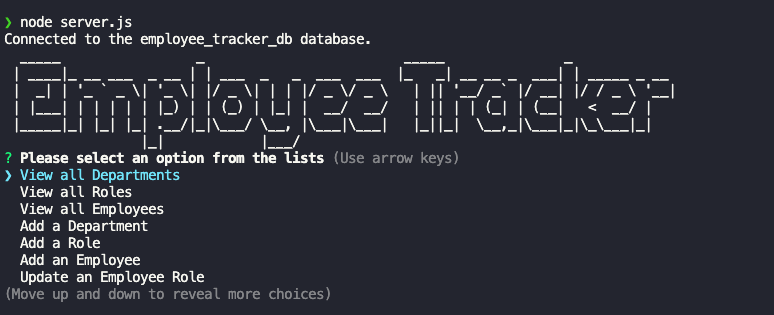
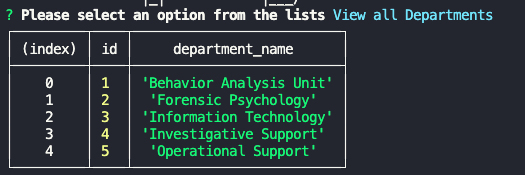

# Employee Tracker

## Table of Contents

- [**Description**](#📑-description)
- [**Installation**](#💾-installation)
- [**Usage**](#💻-usage)
- [**Technology**](#🚀-technology)
- [**Questions**](#❓-questions)

## 📑 Description

Employee Tracker is a command-line application content management system(CMS) used for managing employee data. Users can access data and view the output in formatted tables. Users can view all roles, all departments and all employees as well as add a new department, new roll and a new employee. There is also the option to update the role for any employee and view employees by department. 

[Walkthrough Video Here](https://youtu.be/fa7XoPzHQaEXoPzHQaE)

## 💾 Installation
To install, clone down from GitHub Repository. Once cloned down to local machine, open root folder in terminal. Run `npm i` to install required modules and packages: Inquired and Mysql2. Once complete run `npm start` to load database and associated tables and data are populated and the application starts. 

## 💻 Usage

Employee Tracker is a dynamic CMS that can effectively manage a company's employee data. After installation, run `node server.js` to initialize the application. Once run, the user will be presented with the following options:

If the user were to select "View all Departments" they would be presented with a formatted table of all departments:

Users can also add new departments, roles and employees.

## 🚀 Technology 

- **Inquirer 8.24**
- **Figlet**
- **Console.table**

## ❓ Questions

🖐 My name is Cassie! If you have any question about me or the project, feel free to contact me:

- Github: [CTep09](https://github.com/CTep09)

- Email:[CassandraY9@gmail.com](mailto:cassandray9@gmail.com)
